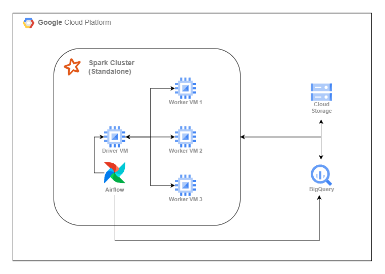
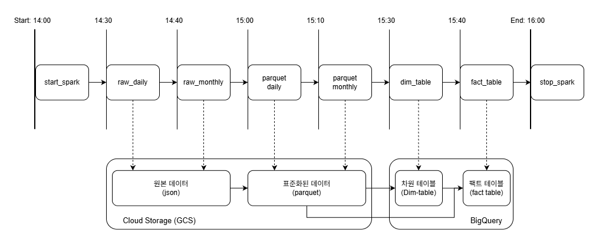

# 개요
## spark-pipeline
Google Cloud에 Spark Cluster를 구축하고 서울시 버스 데이터를 이용하여 Spark 파이프라인을 설계하는 프로젝트

[프로젝트 기록 노션 페이지](https://www.notion.so/Spark-Pipeline-313103c0763380bbb113cba515c083b9?source=copy_link)

## 사용 기술


## 프로젝트 구조도

- 클러스터는 4개의 서버로 구성
    - Standalone, Client Mode로 구동
    - Airflow는 Driver 서버에 Docker Container로 위치하여, SSH를 이용해 Spark 작업 제출

## 사용 데이터
[서울 열린데이터 광장](https://data.seoul.go.kr/)
- **월간 수집 데이터**
    - 서울시 정류장 마스터 정보
    - 서울시 버스노선별 정류장별 시간대별 승하차 인원 정보
    - 서울시 버스노선 기본정보 항목정보
- **일간 수집 데이터**
    - 서울시 버스노선별 정류장별 승하차 인원 정보
    - 서울시 노선별 정류장별 총 버스 운행횟수 정보
    - 서울시 행정동별 버스 총 승차 승객수 정보
- **기타 데이터**
    - [대한민국 행정동 경계 파일](https://github.com/vuski/admdongkor)

---

# 프로젝트 상세
## 디렉터리 구분
```text
spark-pipeline
   ├── airflow_dags/    # Airlfow 코드
   ├── spark_scripts/   # Spark 코드
   ├── tests/           # 데이터 표준화 테스트 코드
   └── imgs/            # 프로젝트 관련 이미지
```

## 데이터 파이프라인 구성
### DAG 타임라인 및 데이터 변화 흐름

**데이터 표준화(parquet 변환) 과정**
- Partition Pruning을 위해 Airflow의 Logical Date를 `dt` 컬럼으로 사용
- parquet 파일의 **스키마 검증** 및 **타입 변환 컬럼의 Null값 여부**를 탐지하는 테스트를 함께 수행(pytest 기반, `tests/` 디렉터리)
    - 테스트는 Driver 서버에서만 실행
    - pytest의 fixture를 이용하여 SparkSession을 한 번만 생성하고 모든 테스트에서 나눠쓰도록 함

**BigQuery 주요 테이블 목록:**
- **차원 테이블(Dimension Table)**:
    - `dim_route`: 버스 노선 차원
    - `dim_stop`: 버스 정류장 차원
    - 대체키(Surrogate Key)사용
    - SCD Type 2 형식으로 사용되도록 `IS_CURRENT`, `START_DATE`, `END_DATE`, `SK` 네 개의 컬럼을 추가함
    - `MERGE` 문을 이용하여 차원 테이블의 `UPSERT` 로직 설계
- **팩트 테이블(Fact Table)**:
    - `fact_dong_hour_passenger`: 행정동별 시간별 승객 수
    - `fact_route_stop_passenger_opr`: 노선별 정류장별 승객 수 및 운행 수

### 스케줄 외 작업 (수동 실행)
- **`dim_ding`**
    - Spark 코드로만 작성됨
    - 행정동 차원 테이블
    - `GEOMETRY` 컬럼을 GEOGRAPHY 타입으로 직접 변경해야 함
- **`ml_pipeline.py`**
    - Airflow DAG(`Schedule = None`)
    - **노선별 정류장별 버스 운행 효율성**을 예측하는 모델을 훈련
        - 운행 효율성: `(승차 승객 + 하차 승객) / 운행 수`
    - 모델 훈련에 사용될 테이블을 Spark 작업으로 생성 (`feature_route_stop_psng_opr`)
    - 타겟 변수, 파생 변수는 BigQueryOeprator로 생성
    - 모델 훈련, 테스트 및 모델 저장 (`ml_pipeline_spark.py`)

---
### 기타 - 주요 Spark 설정
- `spark.master: 10.128.0.2`
    - Spark 작업을 자동으로 클러스터에서 실행하도록 함
- `spark.driver.port: 7078`
- `spark.blockManager.port: 7079`
- `spark.port.maxRetreis: 3`
    - 허용된 포트(7078 ~ 7091) 안에서만 작업이 수행되도록 함
    - 동시에 최대 3개의 작업만 허용
- `spark.sql.shuffle.partitions: 6`
    - 클러스터의 최대 코어 수와 매칭(Worker 서버 코어 각 2개, 총 6개)
- `spark.worker.cleanup.interval: 600`
- `spark.worker.cleanup.appDataTtl: 86400`
    - 저장공간 부족으로 인한 운영 장애를 예방하기 위한 설정
    - 10(600)분 주기로 1일(86400)이 지난 로그 파일을 제거
